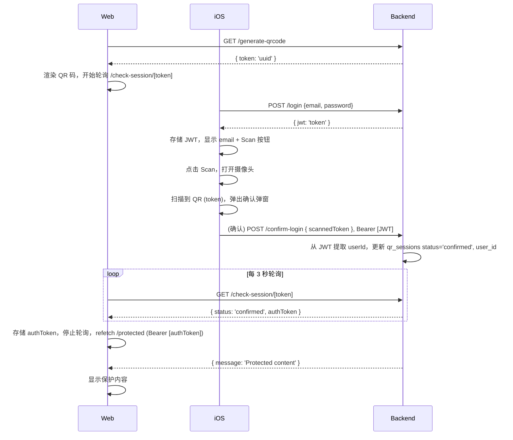

# QR Code Login Demo

This is a simple demo project demonstrating a QR code-based login system. It consists of:
-  **Web Frontend**: Built with Next.js (React), renders QR codes and polls for confirmation.
-  **Backend**: Built with Hono.js (Node.js), PostgreSQL for data storage, and JWT for authentication. Handles token generation, confirmation, and protected routes.
-  **iOS App**: Built with SwiftUI, allows users to log in, scan QR codes, and confirm logins.

The system simulates a cross-device login flow (e.g., scan QR on mobile to log in on web). It's designed for learning and testing purposes only.

**Important Warning**: This is a demo and **NOT suitable for production**. It uses hardcoded credentials, no password hashing, insecure practices (e.g., plain HTTP, no input validation), and minimal error handling. In production, use secure hashing (e.g., bcrypt), HTTPS, proper validation, and a real database with user registration. Do not deploy this as-is, as it could expose security risks.

